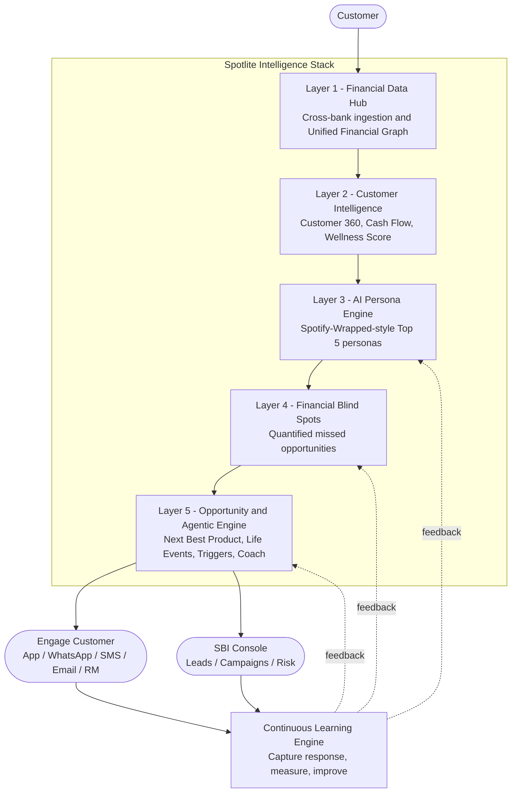
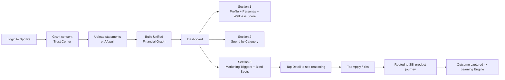
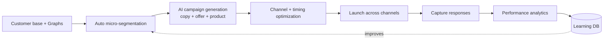
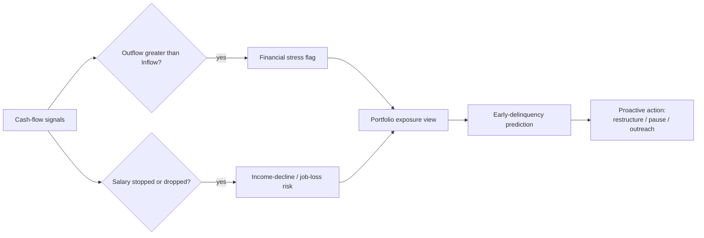
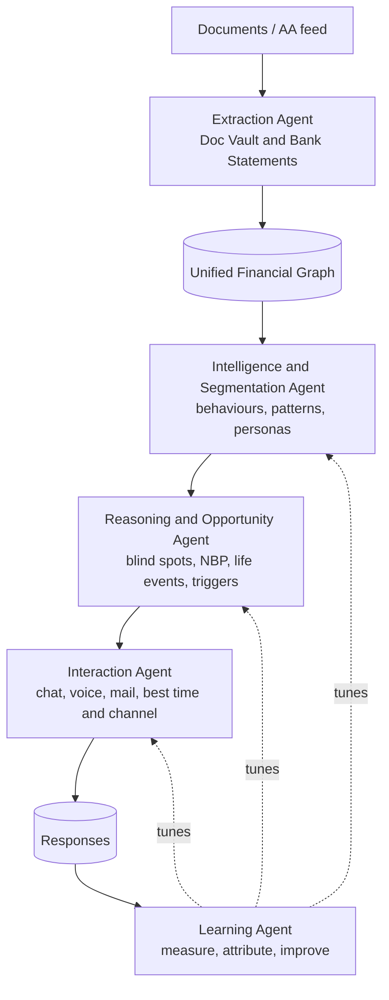

# Spotlite — Business Blueprint

**An Agentic Financial Intelligence Platform for SBI**
*SBI Hackathon · Theme: Digital Engagement → Agentic AI & Emerging Tech*

> Theme brief: "Create AI-driven engagement models that proactively interact with customers based on behaviours, financial patterns, and life events."

This document is the **business/solution design** for Spotlite. It is intentionally technology-agnostic — no stack, framework, or infra decisions. It doubles as the pitch narrative and the outline for the mock UI we will build next.

---

## Table of Contents

1. [Executive Summary & The Problem](#1-executive-summary--the-problem)
2. [The 5-Layer Platform](#2-the-5-layer-platform)
3. [Who We Serve (Personas & Users)](#3-who-we-serve-personas--users)
4. [Full Feature Catalog](#4-full-feature-catalog)
5. [India / SBI-Specific Value-Adds](#5-india--sbi-specific-value-adds)
6. [End-to-End Flows](#6-end-to-end-flows)
7. [Agentic AI Design (Agent Roster)](#7-agentic-ai-design-agent-roster)
8. [Business Model & Commercialization](#8-business-model--commercialization)
9. [Hackathon Demo MVP Slice + Judging Alignment](#9-hackathon-demo-mvp-slice--judging-alignment)
10. [Phase-2 Future Vision](#10-phase-2-future-vision)
11. [Frontend-Backend Integration & Performance Architecture](#11-frontend-backend-integration--performance-architecture)

---

## 1. Executive Summary & The Problem

### The one-sentence pitch

> **Spotlite is the Financial Intelligence Layer between a customer's life and the bank** — an Agentic AI platform that transforms scattered, cross-bank transactions into personalized financial insights, proactive life-event detection, and AI-driven engagement opportunities for SBI.

### The wedge: banks are blind to the customer's real life

Almost every bank today knows **what happened inside its own ecosystem**. Almost none understand **what is happening in the customer's whole financial life**.

- SBI sees the salary credit, but not the ₹15,000/month SIP going to a competitor's mutual fund.
- SBI sees the savings balance growing, but never tells the customer they're losing ₹20,000/year by not moving it to an FD.
- SBI sees rent debits for 12 months, but never connects that to a home-loan opportunity.

This gap is the opportunity. **Spotlite closes it** and turns it into proactive, agentic engagement.

### The reframe (why this wins the theme)

Most teams will build *a chatbot, a recommendation engine, or a dashboard*. Spotlite is positioned one level up — as an **autonomous financial intelligence platform** that runs a continuous loop:

| Stage | What Spotlite does |
| --- | --- |
| **Understand** | Builds a complete picture of the customer's financial life across all banks. |
| **Reason** | Uses AI agents to detect opportunities, risks, and life events. |
| **Act** | Generates personalized, timely engagement for both the customer and SBI. |
| **Learn** | Captures every response to continuously improve future recommendations. |

This shifts the conversation from "AI analytics" to **"AI that observes, thinks, decides, and engages"** — exactly the agentic narrative the theme rewards.

### The killer insight: share-of-wallet leakage

Because Spotlite ingests cross-bank data, SBI can — for the first time — *see money leaving its walls*: EMIs paid to Bajaj Finserv, SIPs at another AMC, credit-card spends on an HDFC card, FDs parked at ICICI. Every outflow is a **win-back opportunity**. Spotlite quantifies "share of wallet" and tells SBI exactly where it is losing the customer's money — and how to bring it back.

### Who wins

- **The customer** gets a financial wellness companion that makes them money and reduces stress.
- **SBI** gets higher cross-sell, higher wallet share, earlier risk signals, and cheaper, better-timed marketing.
- **The Relationship Manager (RM)** gets an AI copilot that whispers the next best action for every customer.

---

## 2. The 5-Layer Platform

Spotlite is best understood not as screens, but as **layers of intelligence** stacked on top of raw transactions. Each layer adds meaning; the top layer acts; everything feeds a learning loop.



| Layer | Name | One-line purpose |
| --- | --- | --- |
| 1 | **Financial Data Hub** | Merge cross-bank transactions into one Unified Financial Graph. |
| 2 | **Customer Intelligence** | Turn the graph into a rich Customer 360 + Financial Wellness Score. |
| 3 | **AI Persona Engine** | Describe *who this person is* with Top-5 personas. |
| 4 | **Financial Blind Spots** | Quantify what the customer is missing, in rupees. |
| 5 | **Opportunity & Agentic Engine** | Reason, prioritize, detect life events, and engage at the right time/channel. |
| ∞ | **Continuous Learning Engine** | Close the loop: every response makes the next recommendation smarter. |

---

## 3. Who We Serve (Personas & Users)

Spotlite is **dual-sided**: a customer-facing wellness experience *and* a bank-facing engagement & risk copilot.

### A. Customer archetypes (the people we analyze)

Grounded in the original sketches and extended:

- **High Spender** — large discretionary outflow, top merchants like Amazon/Flipkart/Swiggy.
- **Big-Time Traveller** — heavy airline/hotel spend; forex and travel-card candidate.
- **Low-Risk Investor** — savings/FD heavy, under-invested in equity.
- **Big Movie Goer / Subscription Native** — recurring Netflix/Prime/BookMyShow.
- **Salaried Wealth Builder** — stable income, growing balance, idle cash.
- **Rent-Paying Aspirant** — long rent history, home-loan-ready.
- **Multi-Bank Juggler** — relationships across HDFC/ICICI/Axis/Kotak — prime win-back target.

### B. Internal SBI users (the people who act)

| User | What Spotlite gives them |
| --- | --- |
| **Marketing / Campaign Manager** | Auto-built micro-segments, generated campaign copy, channel & timing recommendations, response analytics. |
| **Risk / Credit Officer** | Early-warning signals (financial stress, income decline, job-loss risk), portfolio exposure view, early-delinquency prediction. |
| **Relationship Manager (RM)** | A per-customer "Next Best Action" copilot — what to pitch, why, and when, with a ready talk-track. |
| **Branch Staff** | Simple top-3 opportunities per walk-in customer for face-to-face conversations. |
| **Product Owner** | Demand signals — which products have the highest opportunity scores across the book. |

---

## 4. Full Feature Catalog

This is the complete feature set, grouped by layer. Items marked **(MVP)** are in the hackathon demo slice (Section 9); others are full-vision.

### Layer 1 — Financial Data Hub

**Goal:** stop reading PDFs; start understanding *this person*.

**Input sources**
- SBI statements **(MVP)**, plus HDFC, ICICI, Axis, Kotak, and any bank.
- Credit-card statements, UPI transaction exports.
- Loan statements, investment/demat statements.
- Optional enrichment: salary slips, Form 16, insurance policies.

**Features**
- **Multi-document upload & auto-classification** — drop in a year's worth of statements; Spotlite detects bank, account type, and statement period **(MVP for SBI + one other)**.
- **Transaction normalization & enrichment** — clean merchant names, assign categories (Fuel, Grocery, Restaurant, Travel, Movies, Utilities, Medical, Education, Entertainment), tag recurring vs one-off **(MVP)**.
- **Deduplication across sources** — the same UPI txn seen in two statements is merged once.
- **Unified Financial Graph** — the core asset. A single connected model of the person:

```
Person
 └─ Accounts (savings, salary, current, credit card, loan, demat, FD/RD)
     └─ Transactions
         └─ Merchants
             ├─ Income (salary, freelance, rental, interest, dividend, cash deposits)
             ├─ Expenses (rent, utilities, fuel, food, shopping, travel, medical, education)
             ├─ Assets (balances, FD, RD, investments, gold)
             ├─ Liabilities (loans, credit-card dues)
             ├─ Recurring payments (subscriptions, EMIs, SIPs)
             ├─ Investments
             └─ Loans
```

- **Account Aggregator (AA) ready** — Phase-2, replace manual upload with RBI's consent-based AA pull (see Section 5). The "no PDF" future story.

### Layer 2 — Customer Intelligence (Customer 360)

**Goal:** turn the graph into a single, rich profile — richer than any bank's internal CRM.

**Identity & relationship** *(matches the "Customer 360" sketch)*
- Name, address, age, gender, city, occupation, employer, salary band, credit score (optional). **(MVP: name/age/city + summary)**
- **Cross-bank product holdings**: Savings (HDFC, ICICI), Credit Card (SBI), Home Loan (N.A.), Personal Loan (Bajaj Finserv), FD/RD, Demand Draft, Locker, Insurance, Mutual Funds, NPS, PPF, Gold Loan — *across all banks, not just SBI*. **(MVP, simplified)**

**Cash Flow Intelligence** *(matches the "Cash Flow" sketch)*
- **Income** breakdown: salary, freelance, rental, interest, dividend, cash deposits. **(MVP)**
- **Expense** breakdown by category. **(MVP)**
- Derived metrics: **net savings, disposable income, savings rate, debt ratio (EMI/income)**. **(MVP)**
- Trend view: average monthly balance over the last 6–12 months (the basis for the FD trigger).

**Financial Wellness Score** — people love scores; this is the emotional hook. **(MVP)**

```
Financial Wellness: 81 / 100
  Savings      85
  Liquidity    72
  Debt         91
  Investment   66
  Insurance    58
  Risk         74
```

- Each sub-score has a plain-language "why" and a "how to improve" link into a blind spot or trigger.

### Layer 3 — AI Persona Engine ("Spotify Wrapped for money")

**Goal:** describe *who this person is*, delightfully. One badge is boring; generate **Top-5 personas**.

- **Top-5 Personas card** with confidence, mapped to the sketch personas. **(MVP)**
- **Top Merchants** leaderboard (Amazon ₹10,000, Flipkart ₹9,000, Swiggy ₹5,000, Netflix ₹1,200). **(MVP)**
- **Spend-category tiles** (Grocery, Fuel, Lifestyle, Airlines, Railway, Movie). **(MVP)**

**Persona libraries**
- **Lifestyle:** Luxury Shopper, Budget Conscious, Impulse Buyer, Family First, Minimalist, Frequent Traveller, Weekend Explorer, Movie Buff, Foodie, Fitness Enthusiast, Tech Lover, Investor, Entrepreneur, Digital Native, Cash Heavy, UPI Native.
- **Financial:** Salary Driven, Business Owner, Growing Income, Stable Income, Seasonal Income, Debt Heavy, Debt Free, High Savings, High Investments, Low Liquidity, Emergency Ready, Tax Optimizer, Credit Optimizer.
- **Banking:** Multi-bank Customer, Credit-Card Collector, FD Lover, Investment Explorer, Loan Seeker, Digital Banking Champion, Branch Visitor, Dormant Customer, Premium Customer.

### Layer 4 — Financial Blind Spots (Missed Opportunities)

**Goal:** the coolest, most shareable part. Not recommendations — **"here's money you're leaving on the table,"** each quantified in rupees. *(Matches the Trigger Intelligence sketch.)*

| Blind Spot | The math we show | Example output |
| --- | --- | --- |
| **Savings** | Avg balance × (FD rate − savings rate) | ₹18L idle at 3% vs 7% FD → **₹42,300/yr missed**; sketch value **₹20,000 in 6 months (MVP)** |
| **Credit-Card rewards** | Eligible spend × reward delta of best card | ₹8L travel spend earned ₹14k, could earn ₹61k → **₹47,000 lost**; sketch value **₹50,000 (MVP)** |
| **Investment / idle cash** | Idle cash → SIP projection | ₹2L idle → ₹15k/mo SIP → **₹1.3 Cr potential wealth** |
| **Rent vs Home Loan** | Rent inflation vs EMI + asset appreciation | ₹60k rent → ₹7.2L/yr → ₹1 Cr over 10 yrs; ₹1 Cr loan, EMI ₹68k–₹1L → **₹3 Cr asset (MVP)** |
| **Insurance gap** | High medical spend, no health cover | "No health insurance detected → recommend Health Cover" |
| **Tax** | Unused 80C / 80D / 80CCD(NPS) / ELSS; old vs new regime | **₹38,000 estimated tax saving** |
| **Credit-score** | Utilization vs ideal 30% | 85% utilization → +40 expected score improvement |

Each blind spot becomes a card with **"Detail"** (the reasoning) and **"Apply / Yes"** (the action) — exactly as drawn in the Trigger Intelligence sketch, tagged **High / Moderate** severity.

### Layer 5 — Opportunity & Agentic Engine

**Goal:** the AI reasons *before* acting. This is what makes it agentic, not a rules dashboard.

**5a. Next-Best-Product with Opportunity Scores** **(MVP, simplified)**
Instead of "sell everything," prioritize:

```
FD            96%
Credit Card   91%
Home Loan     82%
Mutual Fund   74%
Insurance     62%
Personal Loan 18%
```

**5b. Agentic reasoning (worked example)**

```
Customer has: Salary + No FD + ₹12L idle + balance growing 6 months
        ↓ (reason)
High confidence FD opportunity → estimated annual gain ₹X
        ↓ (act)
Suggest SBI FD via best channel at best time
```

**5c. Life-Event Detection** — banks don't know when life changes; AI infers it from transaction signals:

| Signal | Inferred life event |
| --- | --- |
| Salary suddenly doubles | Promotion / job change |
| Large jewellery purchases | Wedding |
| Hospital expenses spike | Medical emergency |
| New recurring school fees | New child / schooling |
| Rent debits begin in a new city | Relocation |
| Foreign-currency transactions | International travel |
| Repeated furniture / car-dealer payments | New home / new car |
| Salary stops | Job-loss / income-distress risk |
| Frequent ATM withdrawals | Cash stress |

**5d. Agentic Trigger Engine** — the biggest differentiator. The AI continuously watches and fires trigger → reason → action:

| Trigger | Action |
| --- | --- |
| Salary increased | Suggest wealth management |
| Rent rising | Suggest home loan |
| Frequent airline payments | Travel credit card |
| Idle cash | FD |
| Large EMI burden | Debt restructuring |
| Salary missing | Financial-distress monitoring |
| High credit utilization | Credit-limit increase |
| Netflix + Spotify + Prime recurring | Entertainment credit card |
| Investment maturity | Reinvest suggestion |
| Birthday | Personalized offer |
| Travel to Dubai | Forex card |
| Salary credited | Investment reminder |
| Bonus received | Tax planning |

**5e. Interaction Intelligence** — not just *what* to recommend, but **when, where, how**:

```
Best Day · Best Time · Best Channel
Channels: WhatsApp · Email · SMS · Phone · App Notification · Relationship Manager
```

**5f. AI Financial Coach** — replace the dashboard with a conversation **(MVP, scripted demo Qs)**:

```
"How much did I spend on food?"
"How much rent did I pay last year?"
"Can I buy a ₹70 lakh house?"
"Can I retire by 55?"
"Where am I wasting money?"
"Can I save ₹20k every month?"
"Which credit card is best for me?"
"How much did I spend on Swiggy?"
```

This is the **wow moment** of the demo.

---

## 5. India / SBI-Specific Value-Adds

These are the details that make Spotlite credible to *SBI* judges specifically, not a generic global fintech.

- **Account Aggregator (RBI / Sahamati) framework** — the legal, consent-based pipe for cross-bank data in India. SBI already participates as an FIP; Spotlite positions SBI as an **FIU** consuming consented data. This turns "upload your PDFs" (demo) into "one-tap consent" (production) and is fully RBI-aligned.
- **DPDP Act 2023 compliance & Consent / Trust Center** — explicit, revocable, purpose-bound consent; data minimization; "you own your data" messaging. Critical for a PSU bank's trust posture.
- **UPI-spend intelligence** — India is UPI-first; Spotlite mines UPI flows (P2M vs P2P, merchant categories, frequency) that card-only analytics miss.
- **Vernacular / multilingual AI Coach** — Hindi + major regional languages, for SBI's enormous semi-urban and rural base. A differentiator no global template offers.
- **WhatsApp-first engagement** — the dominant channel in India; the coach and triggers are delivered conversationally over WhatsApp, not just an app.
- **Festival & seasonal trigger calendar** — Diwali offers, **Akshaya Tritiya** gold/SGB nudges, wedding-season loans, school-fee-season planning, financial year-end (March) tax nudges.
- **SBI product mapping** — recommendations map to the real catalog: **YONO** journeys, **SBI Card**, SBI **FD/RD**, **SBI Home Loan**, **SBI Life** insurance, **SBI Mutual Fund**, **PPF / NPS / Sovereign Gold Bonds / Sukanya Samriddhi**, Gold Loan.
- **Share-of-Wallet & "Money Leaving SBI" win-back** — quantify how much of the customer's financial life sits outside SBI (competitor EMIs, other-bank FDs, external SIPs) and generate win-back plays.
- **RM Copilot** — for SBI's relationship-managed segment, a per-customer next-best-action whisper with talk-track and rupee-value, usable in-branch or on a call.
- **Financial-inclusion angle** — wellness scoring and coaching extend naturally to first-time/Jan-Dhan customers, aligning with SBI's national mandate.

---

## 6. End-to-End Flows

### 6.1 Customer flow (B2C wellness experience)



The three dashboard sections map exactly to the original spec:
- **Section 1 — User Profile:** name, address, age, gender, banks & accounts, plus a one-line summary ("high spender, high earner, frequent traveller, high restaurant visitor, high stock-market exposure").
- **Section 2 — Spending:** category breakdown (Fuel, Restaurant, Grocery, Movies, etc.) with top merchants.
- **Section 3 — Marketing Triggers:** the FD trigger (₹20k missed interest from idle, growing savings), the Travel-card trigger (₹50k rewards missed on ₹5L air travel), and the Home-loan trigger (₹60k/mo rent → ₹7.2L/yr → ~₹1 Cr/10yr vs ₹1 Cr loan, ~₹1L EMI → ₹3 Cr asset).

### 6.2 Bank / campaign flow (B2B engagement console)



### 6.3 Risk / "BlindSpot for Bank" flow (early warning)



This covers the PDF's "BlindSpot for Bank": financial stress (outflow > inflow), job-loss impact on the individual's credit services and the wider portfolio, and the bank acting as a pass-through agent.

---

## 7. Agentic AI Design (Agent Roster)

Business-level only — roles and decisions, not implementation. This maps directly to the PDF's architecture (Extraction → Behaviours/Segment → Search/Query/Analyze → Chat/Voice/Mail) and adds the learning agent.



| Agent | Role | Key decisions it makes |
| --- | --- | --- |
| **Extraction Agent** | Read & normalize any statement/doc into the graph. | Which bank/account? What category? Recurring or one-off? Duplicate? |
| **Intelligence & Segmentation Agent** | Compute Customer 360, cash flow, wellness score, personas. | Which Top-5 personas? Which micro-segment? |
| **Reasoning & Opportunity Agent** | The "thinking" core — blind spots, opportunity scores, life events, triggers. | Is there an opportunity? How confident? What's the rupee value? Which product? |
| **Interaction Agent** | Decide and deliver the engagement. | Best day/time/channel? What copy/talk-track? Follow-up cadence? |
| **Learning Agent** | Close the loop. | Did it convert? Which trigger/channel/timing works for which persona? Re-rank. |

The agents are **orchestrated as a continuous loop**, not a one-shot pipeline — the defining property of an agentic system: it *observes, thinks, decides, engages,* and *learns*.

---

## 8. Business Model & Commercialization

### 8.1 Value proposition (pitch outcomes, not features)

| Pillar | What SBI gets |
| --- | --- |
| **Revenue Growth** | Higher cross-sell, higher wallet share, higher FD / Credit-Card / Home-Loan / Insurance conversion. |
| **Risk Mitigation** | Early-warning signals, delinquency avoidance, portfolio risk view, income-decline detection. |
| **Customer Experience** | Financial wellness, one cross-bank dashboard, hyper-personalization, life-event awareness. |
| **Operational Efficiency** | AI-driven campaign management — auto segment build, automated solicitation, response analysis. |

### 8.2 Commercialization models (from the concept doc)

1. **Platform Build** — implementation project; price scales with the size of the lending institution.
2. **Subscription** — priced by the variety of intelligence models availed (personas, blind spots, risk, etc.).
3. **Outcome-Based** — revenue tied to measurable revenue increase, customer retention, and portfolio-loss prevention.

### 8.3 Illustrative KPIs (what we'd measure)

- **Revenue:** cross-sell ratio, FD/CC/Home-Loan conversion %, incremental wallet share, win-back value reclaimed.
- **Risk:** % of delinquencies pre-flagged, reduction in early-delinquency, portfolio-at-risk identified.
- **CX:** Financial Wellness Score uplift, NPS, MAU / coach engagement.
- **Marketing/Ops:** campaign CTR & conversion, cost-per-acquisition reduction, % campaigns auto-generated, spam reduction.

---

## 9. Hackathon Demo MVP Slice + Judging Alignment

> **The demo strategy:** show one *believable, end-to-end* vertical for a single synthetic SBI customer rather than a broad-but-shallow product. Depth of reasoning beats breadth of screens.

### 9.1 The thin vertical we will actually build (mock UI)

1. **Login + consent** → land on dashboard.
2. **Upload** 1–2 statements (SBI + one other bank) for one synthetic customer (or pre-loaded sample).
3. **Section 1 — Customer 360**: profile, cross-bank holdings, cash-flow summary, **Financial Wellness Score** with sub-scores.
4. **Persona card** — Top-5 personas + top merchants + spend-category tiles (the Spotify-Wrapped moment).
5. **Section 2 — Spend** by category.
6. **Section 3 — 3 quantified triggers** (the heart of the demo):
   - **FD** — idle, growing savings → "you lost ₹20,000 in 6 months" → Detail / Apply.
   - **Travel Credit Card** — ₹5L air travel → "₹50,000 rewards missed" → Detail / Apply.
   - **Home Loan** — ₹60k/mo rent → "₹7.2L/yr, ~₹1 Cr/10yr; ₹1 Cr loan, ~₹1L EMI → ₹3 Cr asset" → Detail / Apply.
7. **AI Financial Coach** — answer 3–4 scripted questions ("How much did I spend on Swiggy?", "Can I buy a ₹70L house?").
8. **(Optional) SBI console glimpse** — show the same customer as a generated *lead* with opportunity scores, proving the dual-sided story.

### 9.2 Mapping demo beats to likely judging criteria

| Judging dimension | Where the demo proves it |
| --- | --- |
| **Innovation / originality** | The "financial intelligence layer" reframe + cross-bank blind spots + Spotify-Wrapped personas. |
| **Agentic depth (theme fit)** | The trigger → reason → act → learn loop; the worked FD reasoning example; the agent roster. |
| **Business value for SBI** | Rupee-quantified triggers, share-of-wallet win-back, dual-sided lead/console view. |
| **Feasibility** | Statement-upload MVP today, Account Aggregator tomorrow; clear phased roadmap. |
| **UX / wow factor** | Wellness Score, Top-5 personas, and the conversational AI Coach. |
| **India/SBI relevance** | AA + DPDP framing, UPI, vernacular, WhatsApp, real SBI product mapping. |

### 9.3 What we explicitly defer (and say so)

Voice agent, full multi-bank AA integration, real campaign execution, RM console depth, fraud detection — all named as **Phase-2** so judges see the vision is intentional, not incomplete.

---

## 10. Phase-2 Future Vision

When judges ask "what next?":

- **Open Banking via Account Aggregator** — one-tap consented cross-bank data, no uploads.
- **Deep UPI intelligence** — merchant-level behavioural modeling.
- **Voice banking agent** — IVR / smart-speaker financial coach.
- **WhatsApp financial coach** — full conversational engagement on India's #1 channel.
- **Family / household financial planning** — joint graphs, goals, shared budgets.
- **SME financial intelligence** — extend the engine to small-business banking.
- **Fraud & anomaly detection** — the same graph powers risk and security.
- **Goal-based wealth planning** — retirement, child education, home — tracked and nudged.
- **AI Copilot for SBI Relationship Managers** — next-best-action at scale across the relationship-managed book.

---

## 11. Frontend-Backend Integration & Performance Architecture

To ensure a seamless, ultra-fast user experience across registration, onboarding, and dashboard page transitions, the platform implements a high-performance integration model between the Vite/React frontend and FastAPI backend:

### 11.1 Non-Blocking Backend Token Verification
- **Threadpool Execution (`asyncio.to_thread`)**: Firebase Admin SDK ID token verification (`verify_id_token` with `check_revoked=True`) performs synchronous HTTP network checks to Google servers. The backend executes this check inside `asyncio.to_thread` to avoid blocking FastAPI's main asyncio event loop, allowing concurrent API requests (`/api/auth/me`, `/api/persons/me`, `/api/statements`) to execute without delay.

### 11.2 Optimized TanStack Router Context & Route Guards
- **In-Memory `AuthSnapshot`**: `AuthContext.tsx` maintains a synchronized, non-blocking `AuthSnapshot` containing `user`, `firebaseUser`, and `loading` state.
- **Router Context Integration**: The router context in `router.tsx` and `__root.tsx` receives `auth: getAuthSnapshot()`.
- **Zero-Latency Route Guards (`beforeLoad`)**: Route guards in `_app.tsx` and `onboarding.tsx` check the in-memory `AuthSnapshot` first. During client-side navigation between dashboard tabs (`/home`, `/spending`, `/profile`, `/coach`), route validation completes in 0ms without making blocking HTTP network calls (`/api/auth/me`) on every click.

### 11.3 Synchronized Profile Metadata & Instant Dashboard Display
- **Unified `UserResponse` Schema**: The backend (`/api/auth/me` and `/api/auth/sync`) joins `Person.full_name` with the `User` model and returns `full_name` directly in the auth response payload.
- **Instant Name Display**: `AuthContext` stores `full_name` directly in `user`. Dashboard components (`_app.home.tsx`) use `user.full_name` as the primary greeting name immediately upon page mount, eliminating name fallback delays post-onboarding.

---

### Appendix — Source artifacts behind this blueprint

- **Concept PDF (Spotlite, 5 sections):** transaction hub, marketing/risk/experience mining, WhatNext (customer) + BlindSpot (bank) recommendation layers, interaction strategy, learning loop, value proposition, commercialization, and the AI-agent architecture.
- **Sketch 1 — Customer Persona:** personas + top merchants + spend categories.
- **Sketch 2 — Trigger Intelligence:** High/Moderate triggers with Detail/Apply (FD ₹20k, ₹50k credit, rent→home-loan).
- **Sketch 3 — Customer 360:** identity, cross-bank product holdings, cash-flow structure.
- **Theme card:** "Digital Engagement → Agentic AI & Emerging Tech — AI-driven engagement based on behaviours, financial patterns, and life events."
