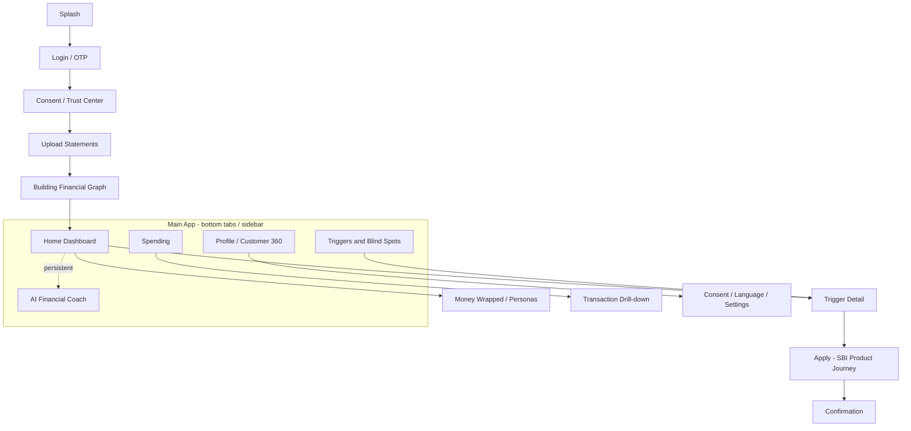

# Spotlite — UI / UX Design Specification

**Customer-facing platform · Responsive web (mobile + desktop) · YONO-inspired**
*Companion to [SPOTLITE_BLUEPRINT.md](SPOTLITE_BLUEPRINT.md)*

This document is the design spec the mock UI will be built from. It is implementation-agnostic (no framework choice) and covers design principles, a design system, a reusable component library, the navigation model, and screen-by-screen wireframes for every screen — for both mobile and desktop where the layout differs.

> Scope: **customer app only** (no bank/RM console). The blueprint's bank-side features are out of scope here and live in [SPOTLITE_BLUEPRINT.md](SPOTLITE_BLUEPRINT.md).

> Wireframe legend: `[ Button ]` = button/CTA · `( )` = radio · `[x]` = checkbox/toggle · `▓▓▓░░` = progress/bar · `◔` = ring gauge · `▸` = expand/navigate · `« »` = scroll/carousel · `└` = nesting.

---

## Table of Contents

1. [Design Principles & Responsive Strategy](#1-design-principles--responsive-strategy)
2. [Design System / Visual Language](#2-design-system--visual-language)
3. [Component Library](#3-component-library)
4. [Information Architecture & Navigation](#4-information-architecture--navigation)
5. [Onboarding Screens](#5-onboarding-screens)
6. [Home Dashboard & Section 1 — Profile / Customer 360](#6-home-dashboard--section-1--profile--customer-360)
7. [Section 2 — Spending](#7-section-2--spending)
8. [Section 3 — Triggers / Blind Spots, Detail & Apply](#8-section-3--triggers--blind-spots-detail--apply)
9. [AI Financial Coach & Money Wrapped / Personas](#9-ai-financial-coach--money-wrapped--personas)
10. [States, Accessibility, Localization & Demo Click-Path](#10-states-accessibility-localization--demo-click-path)

---

## 1. Design Principles & Responsive Strategy

### 1.1 Five design principles

1. **Trust first (PSU-grade).** Every data request is paired with a plain reason and a visible consent control. The Trust Center is one tap away at all times. Security and "you own your data" cues are persistent, not buried.
2. **Proactive, not passive.** The app opens by telling the user something they didn't know — "We found ₹20,000 you're leaving on the table." Spotlite speaks first; it doesn't wait to be asked. This is the agentic personality made visible.
3. **Rupee-forward.** Every insight is quantified in money (₹/year, ₹ missed, ₹ projected). Numbers are the hero; charts support them. Indian number formatting throughout (lakh/crore, `₹1,23,456`).
4. **Delight + shareability.** The Financial Wellness Score and "Money Wrapped" personas are designed to feel like a game/Spotify Wrapped — emotional hooks that make the product memorable in a demo and shareable in real life.
5. **Inclusive & vernacular-ready.** Large tap targets, high contrast, simple language, and a language switcher (English / Hindi / regional) so the same UI serves a metro professional and a semi-urban first-time user.

### 1.2 Responsive strategy (mobile + desktop, one product)

YONO-style, mobile-first, then progressively enhanced for desktop. Same content, re-flowed — never a stripped-down desktop or a blown-up phone.

| Aspect | Mobile (default) | Desktop |
| --- | --- | --- |
| Primary navigation | Bottom tab bar (5 items) | Left sidebar (collapsible) |
| Layout | Single column, stacked cards | 12-column grid; 2-3 card columns; persistent right rail for insights |
| Hero (Wellness Score) | Full-width card at top | Left hero panel + sidebar of sub-scores |
| Coach | Full-screen chat tab | Right-docked chat panel that overlays any screen |
| Trigger detail | Full-screen push | Side sheet / modal over the list |
| Density | Comfortable, thumb-reachable CTAs | Slightly denser, more visible at once |

Breakpoints: see [2.6](#26-grid--breakpoints).

---

## 2. Design System / Visual Language

> All values below are **design tokens** — named, adjustable. Hex values are a recommended starting palette (SBI/YONO-inspired) and can be retuned to official brand assets.

### 2.1 Color tokens

**Brand**

| Token | Value | Use |
| --- | --- | --- |
| `--brand-primary` | `#1F2A7A` (SBI deep indigo/blue) | App bar, primary buttons, key headings |
| `--brand-secondary` | `#5E2A86` (YONO purple) | Gradients, accents, persona theme |
| `--brand-gradient` | `linear(135deg, #1F2A7A → #5E2A86)` | Hero header, splash, score ring |
| `--brand-on-brand` | `#FFFFFF` | Text/icons on brand surfaces |

**Semantic / severity** (used for triggers and scores)

| Token | Value | Meaning |
| --- | --- | --- |
| `--severity-high` | `#D32F2F` (red) | High-priority trigger / weak sub-score |
| `--severity-moderate` | `#F59E0B` (amber) | Moderate trigger |
| `--severity-low` | `#2563EB` (blue) | Informational / low |
| `--success` | `#0F9D58` (green) | Money gained, strong score, positive delta |
| `--danger` | `#D32F2F` | Money lost / risk |

**Neutrals**

| Token | Value |
| --- | --- |
| `--bg` | `#F5F6FA` (app background) |
| `--surface` | `#FFFFFF` (cards) |
| `--surface-alt` | `#EEF0F7` (subtle fills) |
| `--text-primary` | `#15171C` |
| `--text-secondary` | `#5B6075` |
| `--border` | `#E2E5EE` |

**Score color scale** (continuous, for the Wellness ring): 0-40 red → 41-70 amber → 71-100 green.

### 2.2 Typography

System/Inter-style sans, with Devanagari fallback for Hindi.

| Token | Size / weight | Use |
| --- | --- | --- |
| `--font-display` | 32-40 / 700 | Wellness score number, Wrapped |
| `--font-h1` | 24 / 700 | Screen titles |
| `--font-h2` | 18-20 / 600 | Card titles, section headers |
| `--font-body` | 15-16 / 400 | Body text |
| `--font-num` | tabular, 600 | All ₹ amounts (tabular figures so columns align) |
| `--font-caption` | 12-13 / 500 | Labels, metadata, "why" text |

Rules: ₹ amounts always use `--font-num` (tabular) and Indian grouping. Severity words ("High", "Moderate") use the matching severity color.

### 2.3 Iconography
- Rounded, 2px stroke, friendly-but-trustworthy. One icon per spend category (fuel, fork/spoon, cart, film, plane, train, bag), per product (FD, card, home, shield, chart), and per channel (WhatsApp, mail, SMS, bell, phone, RM).
- Status glyphs: ▲ up (good/green), ▼ down (bad/red), • neutral, ⚠ alert.

### 2.4 Cards & elevation
- Radius: `--radius-card: 16px`, `--radius-chip: 999px` (pill).
- Elevation: `e0` flat (list rows), `e1` soft shadow (cards), `e2` raised (sticky CTA, modals).
- Every primary card has: title row (icon + title + optional severity badge), body, and an action row.

### 2.5 Motion
- **Score count-up:** wellness number animates 0 → value on first view (~800ms ease-out); ring fills in sync.
- **Card reveal:** dashboard cards stagger-fade in top→bottom (60ms apart).
- **Trigger "money" emphasis:** the ₹ figure scales 1.0 → 1.08 → 1.0 once on reveal.
- **Processing screen:** graph-building animation (nodes connecting) — see [5.4](#54-processing--building-your-financial-graph).
- Respect `prefers-reduced-motion`: replace with instant fades.

### 2.6 Grid & breakpoints

| Breakpoint | Width | Columns | Gutter | Nav |
| --- | --- | --- | --- | --- |
| `xs` (mobile) | < 600px | 4 | 16px | Bottom tab bar |
| `sm` (large phone/tablet) | 600-1024px | 8 | 20px | Bottom tab bar |
| `md`+ (desktop) | > 1024px | 12 | 24px | Left sidebar + content max-width 1200px |

Spacing scale (`--space-*`): 4, 8, 12, 16, 24, 32, 48.

---

## 3. Component Library

Reusable building blocks. Hero components (★) get full anatomy below.

| Component | Purpose |
| --- | --- |
| ★ Wellness Score Gauge | Big ring + number + 6 sub-score bars |
| ★ Trigger / Blind-Spot Card | The core "money you're missing" unit with Detail/Apply |
| ★ Persona Card / Chip | Spotify-Wrapped-style identity badge |
| ★ Coach Answer Card | Chat reply with number + mini-chart |
| Spend Category Tile | Icon + category + amount + share |
| Top-Merchant Row | Rank + logo/initial + name + amount + bar |
| Bank-Relationship Row | Bank logo + account type + masked number |
| Stat Pill | Label + ₹ value + ▲/▼ delta |
| Upload Dropzone | Drag/drop + detected-file list |
| Summary Chip | One-word persona/trait ("High Spender") |
| Buttons | Primary `[ Apply ]`, secondary `[ Detail ]`, tertiary/text |
| Severity Badge | `High` / `Moderate` / `Low` pill, color-coded |
| Charts | Donut (category split), trend line (balance), projection bar (rent vs asset) |
| Bottom Nav / Sidebar | 5 destinations, active state |
| Sheets/Modals | Trigger detail (mobile=push, desktop=side sheet) |
| States | Skeleton, empty, error, success toast |

### 3.1 ★ Wellness Score Gauge (anatomy)

```
 MOBILE                                  DESKTOP (left hero + right sub-scores)
┌───────────────────────────┐          ┌──────────────────┬──────────────────┐
│   Financial Wellness       │          │                  │ Savings    85 ▲  │
│                            │          │      ◔  81        │ ▓▓▓▓▓▓▓▓░░       │
│          ◔                 │          │   / 100  Good     │ Liquidity  72    │
│        8 1                 │          │                   │ ▓▓▓▓▓▓░░░░       │
│       / 100                │          │  "Up 4 pts vs     │ Debt       91 ▲  │
│      "Good · ▲ +4"         │          │   last month"     │ ▓▓▓▓▓▓▓▓▓░       │
│                            │          │                   │ Investment 66    │
│ Savings    85 ▓▓▓▓▓▓▓▓░    │          │  [ How to improve]│ Insurance  58 ⚠  │
│ Liquidity  72 ▓▓▓▓▓▓░░░    │          │                   │ Risk       74    │
│ Debt       91 ▓▓▓▓▓▓▓▓▓    │          └──────────────────┴──────────────────┘
│ Investment 66 ▓▓▓▓▓▓░░░    │
│ Insurance  58 ▓▓▓▓▓░░░░ ⚠  │   • Ring color follows the 0-40/41-70/71-100 scale.
│ Risk       74 ▓▓▓▓▓▓▓░░    │   • Each sub-score row is tappable → opens "why + how to improve",
│ [ How to improve my score ]│     which deep-links into the matching Blind Spot/Trigger.
└───────────────────────────┘
```

### 3.2 ★ Trigger / Blind-Spot Card (anatomy)

Directly models the "Trigger Intelligence" sketch (severity label, the insight, Detail, "Do you want to apply").

```
┌──────────────────────────────────────────────┐
│ ● High            🏦 Fixed Deposit            │  ← severity badge + product icon
│ ──────────────────────────────────────────── │
│ You lost  ₹20,000  in the last 6 months       │  ← headline ₹ figure (success/danger color)
│ because money sat idle in your savings A/C.   │  ← one-line "why"
│                                                │
│ Avg balance ₹18,00,000 · Savings 3% · FD 7%   │  ← supporting facts row (caption)
│                                                │
│ [ Detail ▸ ]                 [ Apply ]         │  ← secondary + primary CTA
└──────────────────────────────────────────────┘
```
- Severity dot/badge color = High/Moderate/Low token.
- The ₹ headline uses `--danger` for "lost"/"missed" and `--success` for "could earn".
- Collapsed by default on mobile; "Detail" expands inline or pushes to the full Detail screen ([8.2](#82-trigger-detail--reasoning-view)).

### 3.3 ★ Persona Card / Chip

```
CHIP (in strips):  ( 🧳 Big Traveller 92% )   ( 🛍 High Spender 88% )

CARD (Wrapped):
┌───────────────────────┐
│        🧳             │
│   BIG-TIME TRAVELLER  │
│   You're in the top   │
│   8% of travellers    │
│   ₹5,00,000 on flights│
│   ───────────────     │
│   92% match           │
└───────────────────────┘
```

### 3.4 ★ Coach Answer Card

```
🧑 How much did I spend on Swiggy?
                                   ┌──────────────────────────────┐
                                   │ 🍔 Swiggy — last 12 months    │
                                   │      ₹62,400                  │
                                   │ ▁▂▃▅▂▇▃▄▂▆▃▅  (monthly bars)  │
                                   │ That's ₹5,200/mo · 14% of food│
                                   │ [ See all food spend ▸ ]      │
                                   └──────────────────────────────┘
```

### 3.5 Supporting components (compact)

```
Spend Category Tile         Top-Merchant Row              Stat Pill
┌───────────────┐           1 ▸ Amazon    ₹10,000 ▓▓▓▓    ┌──────────────────┐
│ ⛽  Fuel       │           2 ▸ Flipkart   ₹9,000 ▓▓▓     │ Disposable income│
│ ₹24,000   18% │           3 ▸ Swiggy     ₹5,000 ▓▓      │ ₹78,000  ▲ 6%    │
└───────────────┘           4 ▸ Netflix    ₹1,200 ▓       └──────────────────┘
```

---

## 4. Information Architecture & Navigation

### 4.1 Navigation map



### 4.2 Screen inventory (mapped to the blueprint)

| # | Screen | Blueprint anchor |
| --- | --- | --- |
| O1 | Splash | — |
| O2 | Login / OTP | Flow 6.1 (login) |
| O3 | Consent / Trust Center | §5 DPDP, Flow 6.1 |
| O4 | Upload Statements | Layer 1 ingestion |
| O5 | Processing / Graph build | Layer 1 Unified Financial Graph |
| D1 | Home Dashboard | Flow 6.1 dashboard |
| D2 | Profile / Customer 360 (Section 1) | Layer 2 |
| D3 | Spending (Section 2) | Layer 3 spend |
| D4 | Triggers / Blind Spots (Section 3) | Layer 4 + 5d |
| D5 | Trigger Detail | Layer 5b reasoning |
| D6 | Apply / Product Journey + Confirmation | Flow 6.1 act/outcome |
| D7 | AI Financial Coach | Layer 5f |
| D8 | Money Wrapped / Personas | Layer 3 |
| D9 | Settings / Consent management / Language | §5 |

### 4.3 Navigation bars

```
MOBILE — bottom tab bar (sticky)            DESKTOP — left sidebar
┌──────────────────────────────────┐       ┌───────────────┐
│  🏠      📊      ⚡      💬     👤 │       │ ✦ Spotlite    │
│ Home  Spend  Triggers Coach Profile│      │ 🏠 Home        │
└──────────────────────────────────┘       │ 📊 Spending    │
   active item: brand color + label bold     │ ⚡ Triggers  ② │ ← badge = # new triggers
                                            │ 💬 Coach       │
                                            │ 👤 Profile     │
                                            │ ───────────   │
                                            │ ⚙ Settings    │
                                            │ 🌐 EN ▾        │
                                            └───────────────┘
```

---

## 5. Onboarding Screens

### 5.1 O1 — Splash

```
┌───────────────────────────┐
│      (brand gradient)      │
│                            │
│          ✦ Spotlite        │
│   Your money, finally      │
│      understood.           │
│                            │
│         ●  ○  ○            │  ← brief 3-dot intro carousel (optional)
└───────────────────────────┘
```

### 5.2 O2 — Login / OTP (YONO-style)

```
MOBILE                                   DESKTOP (split: brand left, form right)
┌───────────────────────────┐          ┌─────────────────┬──────────────────┐
│ ✦ Spotlite                 │          │  (gradient)      │  Welcome back     │
│                            │          │  ✦ Spotlite      │                   │
│ Welcome 👋                 │          │  "See the money  │  Mobile number    │
│ Log in to see your money   │          │   you're missing"│  [ +91 _________ ]│
│                            │          │                  │  [ Get OTP ]      │
│ Mobile number              │          │   • Bank-grade   │                   │
│ [ +91 __________ ]         │          │     security     │  ──── or ────     │
│ [ Get OTP ]                │          │   • You own your │  [ Continue with  │
│                            │          │     data         │    SBI YONO ]     │
│ ──────── or ────────       │          │                  │                   │
│ [ Continue with SBI YONO ] │          └─────────────────┴──────────────────┘
│                            │
│ 🔒 256-bit encrypted       │   OTP step: 6-box code input, "Resend in 0:30", auto-advance.
└───────────────────────────┘
```

### 5.3 O3 — Consent / Trust Center

Trust is the gate. Explicit, plain-language, DPDP-aligned, revocable.

```
┌──────────────────────────────────────────────┐
│ ← Your data, your rules                        │
│                                                │
│ To find money you're missing, Spotlite needs   │
│ to read your bank statements. Here's the deal: │
│                                                │
│ [x] Read transactions to build my insights     │
│ [x] Detect opportunities & life events         │
│ [ ] Allow SBI to send me matched offers        │  ← optional, OFF by default
│                                                │
│ ✓ We never sell your data                       │
│ ✓ You can delete everything anytime             │
│ ✓ Powered by RBI Account Aggregator (Phase 2)   │
│                                                │
│ Read the full privacy policy ▸                  │
│                                                │
│ [ I Agree & Continue ]                          │  ← primary, disabled until required boxes ticked
└──────────────────────────────────────────────┘
```

### 5.4 O4 — Upload Statements

Multi-bank, multi-document. Detected files list reassures the user the system "understood" each file.

```
MOBILE                                       DESKTOP (dropzone left, detected list right)
┌───────────────────────────┐          ┌──────────────────┬───────────────────────┐
│ ← Add your statements      │          │  ⬆ Drag & drop    │ Detected (4)          │
│                            │          │   statements here │ ✓ SBI Savings  Apr-Mar│
│ ┌───────────────────────┐  │          │   PDF/CSV/Excel   │ ✓ HDFC Savings Apr-Mar│
│ │   ⬆  Tap to upload     │  │          │                   │ ✓ SBI Card     Apr-Mar│
│ │  PDF · CSV · Excel     │  │          │  [ Browse files ] │ ⏳ ICICI ... reading…│
│ └───────────────────────┘  │          │                   │                       │
│                            │          │  Tip: add all     │ Banks: SBI ·HDFC·ICICI│
│ Detected:                  │          │  banks you use    │ Period: 12 months     │
│ ✓ SBI Savings   Apr–Mar    │          │  for the full     │                       │
│ ✓ HDFC Savings  Apr–Mar    │          │  picture.         │ [ Build my dashboard ]│
│ ✓ SBI Card      Apr–Mar    │          └──────────────────┴───────────────────────┘
│ ⏳ ICICI …reading           │
│                            │   • Each row shows bank + account type + auto-detected period.
│ [ + Add another bank ]     │   • "Use sample customer" link for instant demo (loads synthetic data).
│ [ Build my dashboard ]     │
└───────────────────────────┘
```

### 5.5 O5 — Processing / "Building your financial graph"

Turns a loading wait into a proof-of-intelligence moment.

```
┌──────────────────────────────────────────────┐
│            Building your financial graph        │
│                                                │
│            Person ● ─── ● Accounts              │   ← nodes light up & connect in sequence
│              │           │                      │
│           Income ●     ● Merchants              │
│              │           │                      │
│          Expenses ●   ● Recurring               │
│                                                │
│  ✓ Read 3,412 transactions across 3 banks       │  ← live ticking checklist
│  ✓ Categorised spends                            │
│  ⏳ Detecting opportunities…                     │
│                                                │
│            ▓▓▓▓▓▓▓▓░░  80%                       │
└──────────────────────────────────────────────┘
```

---

## 6. Home Dashboard & Section 1 — Profile / Customer 360

### 6.1 D1 — Home Dashboard

The "Spotlite speaks first" screen. Opens with the wellness score and the single biggest money-found headline.

```
MOBILE
┌───────────────────────────┐
│ Hi Rohan 👋        🔔 ⚙    │  ← greeting + alerts + settings
│ (brand gradient header)    │
│                            │
│  ◔ 81  Financial Wellness  │  ← Wellness Gauge (tap → Profile)
│     /100 · ▲ +4 this month │
│                            │
│ ⚡ We found ₹1,17,000 you   │  ← money-found banner (sum of top triggers)
│    could gain. [ See how ▸]│
│                            │
│ Your top personas          │
│ ( 🧳 Traveller )( 🛍 Spender)│  « swipe »
│ ( 🎬 Movie Buff )           │
│ [ See your Money Wrapped ▸]│
│                            │
│ This month                 │
│ ┌─────────┐ ┌─────────┐    │
│ │ In ₹2.1L│ │Out ₹1.4L│    │
│ └─────────┘ └─────────┘    │
│ ┌─────────┐ ┌─────────┐    │
│ │Save ₹70k│ │Idle ₹18L│    │
│ └─────────┘ └─────────┘    │
│                            │
│ Top opportunities          │
│ [Trigger card: FD ₹20k]    │  ← top 1-2 trigger cards inline
│ [Trigger card: Travel ₹50k]│
│ [ See all triggers ▸ ]     │
│                            │
│ 💬 Ask Spotlite anything…  │  ← coach launcher (sticky-ish)
└───────────────────────────┘
[ 🏠 Home  📊  ⚡  💬  👤 ]
```

```
DESKTOP (12-col: main + right insight rail)
┌──────────┬──────────────────────────────────────┬───────────────────────┐
│ SIDEBAR  │ Hi Rohan 👋          🔔  EN ▾  ⚙       │  ⚡ Money found        │
│ 🏠 Home   │ ┌──────────────┐  ┌──────────────────┐ │  ₹1,17,000 total       │
│ 📊 Spend  │ │  ◔ 81 /100    │  │ In  ₹2.1L  ▲     │ │  • FD        ₹20,000   │
│ ⚡ Trig ② │ │  Wellness     │  │ Out ₹1.4L        │ │  • Travel CC ₹50,000   │
│ 💬 Coach  │ │  ▲ +4         │  │ Save ₹70k  Idle₹18L││ • Home loan  ₹47,000*  │
│ 👤 Profile│ └──────────────┘  └──────────────────┘ │  [ See all triggers ]  │
│ ──────   │ Personas: 🧳 🛍 🎬 💳 📈  [Wrapped ▸]   │                        │
│ ⚙ Set    │ ┌───────── Top opportunities ────────┐ │  Recent life event:    │
│          │ │ [FD ₹20k] [Travel ₹50k] [Home ▸]   │ │  ✈ Frequent travel     │
│          │ └────────────────────────────────────┘ │  detected              │
└──────────┴──────────────────────────────────────┴───────────────────────┘
                                                      (Coach docks here on demand 💬)
```

### 6.2 D2 — Profile / Customer 360 (Section 1)

Mirrors the "Customer 360" sketch: identity, bank relationships, product holdings, cash flow — plus the auto-generated summary chips and wellness sub-scores.

```
MOBILE
┌───────────────────────────┐
│ ← Profile                  │
│  (avatar)  Rohan Sharma    │
│  Bengaluru · 34 · Male     │
│  Salaried · IT             │
│                            │
│ How Spotlite sees you      │  ← auto summary chips (the "summary of customer")
│ ( High Spender )( High Earner )
│ ( Frequent Traveller )      │
│ ( High Restaurant Visitor ) │
│ ( High Stock Exposure )     │
│                            │
│ Your banking relationships  │  ← cross-bank, per sketch
│ 🟦 SBI    Savings ····3421  │
│ 🟥 HDFC   Savings ····8890  │
│ 🟧 ICICI  Savings ····2210  │
│ 💳 SBI    Credit Card       │
│ 🏠 Home Loan        N.A.    │
│ 📄 Personal Loan  Bajaj Fin.│
│                            │
│ Cash flow (monthly avg)     │
│ Income   ₹2,10,000          │
│  └ Salary ₹1,90,000         │
│  └ Interest ₹20,000         │
│ Expenses ₹1,32,000          │
│  └ Rent ₹60,000             │
│  └ Lifestyle ₹48,000        │
│ Disposable ₹78,000  ▲       │
│ Savings rate 37%  Debt 22%  │
│                            │
│ Wellness breakdown          │
│ [6 sub-score bars, tappable]│
│ [ How to improve ▸ ]        │
└───────────────────────────┘
```

```
DESKTOP (two columns)
┌───────────────────────────────────┬──────────────────────────────────┐
│ Rohan Sharma · Bengaluru · 34 · M │ Cash flow (monthly avg)           │
│ Salaried · IT                      │ Income    ₹2,10,000  ▲            │
│ Chips: High Spender · High Earner  │  Salary ₹1,90,000 · Interest ₹20k │
│ · Frequent Traveller · High Resto  │ Expenses  ₹1,32,000               │
│ · High Stock Exposure              │  Rent ₹60,000 · Lifestyle ₹48,000 │
│                                    │ Disposable ₹78,000 · Save 37%     │
│ Banking relationships (table)      │ Debt ratio 22%                    │
│ Bank │ Product │ A/C │ Held at     │──────────────────────────────────│
│ SBI  │ Savings │ 3421│ SBI         │ Wellness breakdown                │
│ HDFC │ Savings │ 8890│ HDFC        │ Savings 85 ▓▓▓▓▓▓▓▓░              │
│ ICICI│ Savings │ 2210│ ICICI       │ Liquidity 72 ▓▓▓▓▓▓░░             │
│ SBI  │ Card    │ ----│ SBI         │ Debt 91 · Investment 66           │
│ —    │ HomeLoan│ N.A.│ —           │ Insurance 58 ⚠ · Risk 74          │
│ Bajaj│ P. Loan │ ----│ Bajaj Fin.  │ [ How to improve ▸ ]              │
└───────────────────────────────────┴──────────────────────────────────┘
```

---

## 7. Section 2 — Spending

### 7.1 D3 — Spending overview

Category donut + tiles (per the "Spend Categories" sketch) + top-merchant leaderboard (per the "Top Merchants" sketch) + trend.

```
MOBILE                                      DESKTOP
┌───────────────────────────┐          ┌──────────────────┬───────────────────────┐
│ ← Spending      [12 mo ▾]  │          │  Spending   [12 mo ▾]                     │
│                            │          │ ┌─────────────┐  │ Top merchants          │
│        ( donut )           │          │ │   ( donut ) │  │ 1 Amazon   ₹10,000 ▓▓▓▓│
│     ₹15.8L total spend     │          │ │ ₹15.8L total│  │ 2 Flipkart  ₹9,000 ▓▓▓ │
│                            │          │ └─────────────┘  │ 3 Swiggy    ₹5,000 ▓▓  │
│ ⛽ Fuel       ₹24k   18%   │          │ Categories grid: │ 4 Netflix   ₹1,200 ▓   │
│ 🍴 Restaurant ₹96k   12%   │          │ ⛽Fuel  🍴Resto   │                       │
│ 🛒 Grocery    ₹72k   10%   │          │ 🛒Groc 🎬Movie    │ Monthly trend          │
│ 🎬 Movies     ₹14k    3%   │          │ ✈Air  🚆Rail      │  ▁▂▃▅▂▇▃▄▂▆▃▅          │
│ ✈ Airlines   ₹5.0L   32%   │          │ 🛍Lifestyle       │  balance ▲ growing     │
│ 🚆 Railway    ₹8k     1%   │          │                  │                       │
│ 🛍 Lifestyle  ₹1.2L   8%   │          │ (each tile: icon │ 💡 Airlines is your   │
│                            │          │  + ₹ + % share)  │ biggest category →    │
│ Top merchants              │          │                  │ see Travel CC trigger │
│ 1 Amazon   ₹10,000 ▓▓▓▓    │          └──────────────────┴───────────────────────┘
│ 2 Flipkart  ₹9,000 ▓▓▓     │
│ 3 Swiggy    ₹5,000 ▓▓      │   • Tap a category → filtered transaction list (7.2).
│ 4 Netflix   ₹1,200 ▓       │   • Spotlite inserts a contextual nudge linking spend → a trigger.
│ [ See all transactions ▸ ] │
└───────────────────────────┘
```

### 7.2 D3a — Transaction drill-down

```
┌──────────────────────────────────────────────┐
│ ← ✈ Airlines · ₹5,00,000 · 12 months   [⌕][▾] │
│ ──────────────────────────────────────────── │
│ 12 Mar  IndiGo 6E         ₹42,300   SBI ····34 │
│ 28 Feb  Air India         ₹38,900   HDFC ···89 │
│ 15 Feb  MakeMyTrip        ₹61,200   SBI Card   │
│ …                                              │
│ ──────────────────────────────────────────── │
│ 💡 You paid on non-reward cards. An SBI travel │
│    card would have earned ₹50,000. [ See ▸ ]   │
└──────────────────────────────────────────────┘
```

---

## 8. Section 3 — Triggers / Blind Spots, Detail & Apply

### 8.1 D4 — Triggers / Blind Spots list

Stacked Trigger Cards sorted by severity then ₹ value. The three hero triggers use the blueprint's verbatim figures.

```
MOBILE                                      DESKTOP (2-col card grid)
┌───────────────────────────┐          ┌───────────────────────────────────────────┐
│ ← Triggers   [All ▾][High ▾]│          │ Triggers & Blind Spots     [All▾] sort:₹▾  │
│ Total money found ₹1,17,000 │          │ Total money found: ₹1,17,000               │
│                            │          │ ┌─────────────────┐ ┌───────────────────┐ │
│ ● High  🏦 Fixed Deposit   │          │ │● High 🏦 FD      │ │● High 💳 Travel CC │ │
│ Lost ₹20,000 in 6 months   │          │ │Lost ₹20,000     │ │Missed ₹50,000     │ │
│ idle savings · 3% vs 7%    │          │ │idle savings     │ │₹5L air travel     │ │
│ [ Detail ▸ ]   [ Apply ]   │          │ │[Detail][Apply]  │ │[Detail][Apply]    │ │
│                            │          │ └─────────────────┘ └───────────────────┘ │
│ ● High  💳 Travel Card     │          │ ┌─────────────────┐ ┌───────────────────┐ │
│ Missed ₹50,000 rewards     │          │ │◐ Moderate 🏠Home│ │◐ Moderate 📈 SIP  │ │
│ on ₹5,00,000 air travel    │          │ │Rent ₹60k/mo →   │ │₹2L idle → ₹1.3Cr  │ │
│ [ Detail ▸ ]   [ Apply ]   │          │ │₹3 Cr asset      │ │[Detail][Apply]    │ │
│                            │          │ │[Detail][Apply]  │ └───────────────────┘ │
│ ◐ Moderate  🏠 Home Loan   │          │ └─────────────────┘                       │
│ Rent ₹60k/mo = ₹7.2L/yr.   │          │ ┌─────────────────┐ ┌───────────────────┐ │
│ Over 10 yrs ≈ ₹1 Cr. A     │          │ │○ Tax ₹38,000    │ │○ Insurance gap    │ │
│ ₹1 Cr loan, EMI ~₹1L →     │          │ │80C/NPS unused   │ │No health cover    │ │
│ asset worth ₹3 Cr.         │          │ └─────────────────┘ └───────────────────┘ │
│ [ Detail ▸ ]   [ Apply ]   │          └───────────────────────────────────────────┘
│                            │
│ ◐ Moderate 📈 Idle → SIP   │
│ ○ Low  🧾 Tax ₹38,000      │
│ ○ Low  🛡 Insurance gap    │
└───────────────────────────┘
```

### 8.2 D5 — Trigger Detail / Reasoning view

The agentic "show your work" screen: signal → reason → math → projection → act. (Mobile = full-screen push; desktop = side sheet over the list.)

```
┌──────────────────────────────────────────────┐
│ ← 🏠 Home Loan opportunity        ◐ Moderate   │
│                                                │
│ Why we're telling you this                     │
│  1. We saw rent ₹60,000/mo for 12 months       │  ← signal (from transactions)
│  2. That's ₹7,20,000 a year, ₹0 asset created  │  ← reason
│  3. With ~5% inflation, 10 yrs of rent ≈ ₹1 Cr │
│                                                │
│ The opportunity (projection)                   │
│  ┌──────────────────────────────────────────┐ │
│  │ Rent path      Home-loan path            │ │
│  │ ₹1 Cr spent ▓  ₹3 Cr asset ▓▓▓▓▓▓        │ │  ← projection bar chart
│  │ (gone)         (yours)                   │ │
│  └──────────────────────────────────────────┘ │
│  Loan ₹1 Cr · EMI ~₹1,00,000 · Tenure 10 yr    │
│  Est. asset value in 10 yrs: ₹3 Cr             │
│                                                │
│ Recommended: SBI Home Loan                     │  ← maps to real SBI product
│  Indicative rate · eligibility (you qualify)   │
│                                                │
│ When & how we'll reach you                     │  ← Interaction Intelligence (blueprint 5e)
│  📱 WhatsApp · Best: Sat 11 AM                  │
│                                                │
│ [ Not now ]                 [ Apply for loan ] │
└──────────────────────────────────────────────┘
```

The other two hero detail views follow the same template:
- **FD:** signal (avg balance ₹18L growing 6 mo) → reason (3% vs 7%) → math (₹20,000 lost) → SBI FD → Apply.
- **Travel CC:** signal (₹5L air travel on non-reward cards) → reason (₹14k earned vs ₹61k possible) → ₹50,000 missed → SBI travel card → Apply.

### 8.3 D6 — Apply / Product Journey + Confirmation

```
APPLY (stub journey)                         CONFIRMATION
┌───────────────────────────┐          ┌───────────────────────────┐
│ ← Apply: SBI Fixed Deposit │          │            ✓               │
│ Amount   [ ₹12,00,000   ]  │          │   You're all set!          │
│ Tenure   ( 1yr )(2yr)(3yr) │          │   SBI FD application started│
│ Payout   (Cumulative ▾)    │          │   Ref #SPL-FD-00421        │
│ Est. interest @7%          │          │                            │
│   ₹84,000 / year ▲         │          │   We'll nudge you if       │
│ From A/C [ SBI ····3421 ▾ ]│          │   anything changes.        │
│                            │          │   [ Back to dashboard ]    │
│ [ Confirm & open FD ]      │          │   [ See impact on score ▸ ]│  ← ties back to wellness
└───────────────────────────┘          └───────────────────────────┘
```
Confirmation feeds the blueprint's Learning Engine (response captured).

---

## 9. AI Financial Coach & Money Wrapped / Personas

### 9.1 D7 — AI Financial Coach

The wow moment. Conversation replaces dashboard digging. Suggested-question chips seed the demo; answers come back as Coach Answer Cards with mini-visuals.

```
MOBILE (full tab)                            DESKTOP (right-docked panel over any screen)
┌───────────────────────────┐          ┌───────────────────────────┐
│ ← 💬 Spotlite Coach   🌐EN │          │ 💬 Coach                ✕  │
│                            │          │ ...                        │
│  ✦ Hi Rohan, ask me        │          │  [answer card]             │
│   anything about your money│          │                            │
│                            │          │                            │
│ Try:                       │          │ Try: [Swiggy?][₹70L house?]│
│ ( How much on Swiggy? )    │          │ [ Type a message…    ] [▸] │
│ ( Rent last year? )        │          └───────────────────────────┘
│ ( Can I buy a ₹70L house? )│
│ ( Where am I wasting money?)│   Suggested-question chips (blueprint 5f list):
│ ( Can I save ₹20k/month? ) │     • How much did I spend on food?
│                            │     • How much rent did I pay last year?
│ ──────────────────────     │     • Can I buy a ₹70 lakh house?
│ [answer card: Swiggy ₹62k] │     • Can I retire by 55?
│                            │     • Where am I wasting money?
│ [ Type a message…    ] [▸] │     • Which credit card is best for me?
└───────────────────────────┘
[ 🏠  📊  ⚡  💬Coach  👤 ]
```

Answer types: a number + mini-chart (spend questions), a yes/no + affordability breakdown ("Can I buy a ₹70L house?" → shows EMI, eligibility, gap), or a list (wasted-money → top leaks with a "fix it" link to a trigger).

### 9.2 D8 — Money Wrapped / Personas

Spotify-Wrapped-style, full-bleed, swipeable, shareable. The Top-5 personas plus signature stats.

```
MOBILE (story-style, swipe through cards)
┌───────────────────────────┐   ┌───────────────────────────┐   ┌───────────────────────────┐
│  (gradient)        ● ○ ○ ○ │   │  (gradient)        ○ ● ○ ○ │   │  (gradient)        ○ ○ ● ○ │
│                            │   │                            │   │                            │
│   Your #1 persona          │   │      🧳                     │   │   You spent the most on    │
│                            │   │   BIG-TIME TRAVELLER       │   │       ✈ Airlines            │
│        🛍                   │   │   Top 8% of travellers     │   │       ₹5,00,000             │
│   HIGH SPENDER             │   │   ₹5,00,000 on flights     │   │   32% of all spending      │
│   Top 12% in your city     │   │                            │   │                            │
│                            │   │   92% match                │   │   « swipe »                 │
│   « swipe to see all 5 »   │   │                            │   │                            │
└───────────────────────────┘   └───────────────────────────┘   └───────────────────────────┘
                                                                  Final card: [ Share my Wrapped ]
DESKTOP: the 5 persona cards shown as a row/grid + a "signature stats" panel; same [ Share ] CTA.
```

---

## 10. States, Accessibility, Localization & Demo Click-Path

### 10.1 Cross-cutting states

| State | Pattern |
| --- | --- |
| **Skeleton/loading** | Card-shaped shimmer placeholders (same layout as final), used while the graph builds and on tab switches. |
| **Empty** | Friendly illustration + one action. e.g. no statements → "Add your first statement to find money you're missing. [ Upload ]". No triggers yet → "We're still analysing — check back soon." |
| **Error** | Inline, non-blocking. e.g. unreadable statement → row shows `⚠ Couldn't read this file [ Retry ] [ Remove ]`; never lose the other uploads. |
| **Success** | Toast + subtle confetti on Apply confirmation; wellness score re-animates if it changes. |
| **Offline** | Banner "You're offline — showing last synced data." |

### 10.2 Accessibility
- Contrast AA+ for text on brand gradient (use `--brand-on-brand` white, min 4.5:1); never rely on color alone for severity — always pair with a word/icon (High/Moderate + dot shape).
- Tap targets ≥ 44×44px; bottom-nav items thumb-reachable.
- All charts have a text/number equivalent (the ₹ figure is always shown, chart is supportive).
- Screen-reader labels for the score ("Financial wellness 81 out of 100, good, up 4"), trigger cards ("High priority, Fixed Deposit, you lost 20,000 rupees"), and icon-only buttons.
- Respect `prefers-reduced-motion`.

### 10.3 Localization / vernacular
- Language switcher in the top bar and Settings: English / हिन्दी / regional (Phase-2 list). Persisted per user.
- Layouts use flexible widths (Devanagari/regional strings run longer); no text baked into images.
- Numbers stay in Indian format across languages (₹, lakh/crore). Coach answers respond in the selected language.

### 10.4 Microcopy & tone
- Proactive and encouraging, never preachy. "We found ₹20,000 you can still claim back" beats "You wasted ₹20,000."
- Always pair a problem with a one-tap fix. Money figures lead the sentence.
- Severity words match colors; CTAs are verbs ("Apply", "See how", "Fix it"), mirroring the sketch's "Do you want to apply".

### 10.5 D9 — Settings / Consent management / Language

```
┌───────────────────────────┐
│ ← Settings                 │
│ 🌐 Language        EN ▾     │
│ 🔔 Notifications   [x]      │
│ 📲 Engagement channel       │
│    WhatsApp ▾              │
│ ──────────────────────     │
│ 🔒 Trust Center            │
│   Connected banks (3) ▸    │
│   Permissions ▸           │
│   [ Download my data ]     │
│   [ Delete my data ]       │
│ ──────────────────────     │
│ Log out                    │
└───────────────────────────┘
```

### 10.6 Demo happy-path (the click sequence to rehearse)

Maps to blueprint §9 MVP slice. Keep it to one synthetic customer ("Rohan").

```mermaid
flowchart LR
    A["Login + OTP"] --> B["Consent: I Agree"]
    B --> C["Upload: Use sample customer"]
    C --> D["Processing animation"]
    D --> E["Home: score 81 + found Rs 1,17,000"]
    E --> F["Profile: Customer 360 + summary chips"]
    F --> G["Spending: airlines is 32 percent"]
    G --> H["Triggers: 3 hero cards"]
    H --> I["Trigger Detail: Home loan reasoning + projection"]
    I --> J["Apply: FD confirmation"]
    J --> K["Coach: Swiggy spend + 70L house question"]
    K --> L["Money Wrapped: Top-5 personas + Share"]
```



Narration beats for each step (Understand → Reason → Act → Learn):
1. **Login/Consent** — "Trust-first, DPDP-aligned."
2. **Upload/Processing** — "Cross-bank ingestion → Unified Financial Graph." (Understand)
3. **Home/Profile/Spending** — "One view of the whole financial life, scored." (Understand)
4. **Triggers/Detail** — "The AI reasons and quantifies — ₹ you're missing." (Reason)
5. **Apply** — "One tap to the SBI product; response captured." (Act → Learn)
6. **Coach/Wrapped** — "The wow: talk to your money; see who you are." (Reason + delight)

---

### Appendix — Mapping to the blueprint

| Blueprint element | UI home |
| --- | --- |
| Layer 1 ingestion / graph | O4 Upload, O5 Processing |
| Layer 2 Customer 360 + Wellness | D2 Profile, Wellness Gauge |
| Layer 3 personas + spend | D3 Spending, D8 Wrapped |
| Layer 4 blind spots | D4 Triggers, D5 Detail |
| Layer 5b reasoning | D5 Trigger Detail |
| Layer 5e interaction intelligence | "When & how we'll reach you" in D5 |
| Layer 5f AI coach | D7 Coach |
| §5 DPDP / consent | O3 Consent, D9 Settings/Trust Center |
| Flow 6.1 act → learn | D6 Apply + Confirmation |
